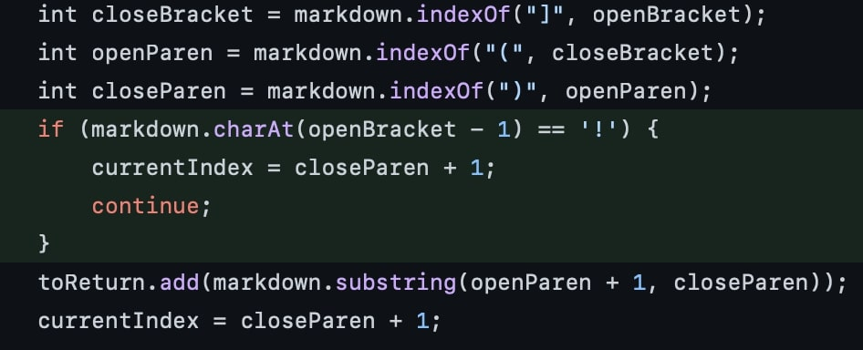
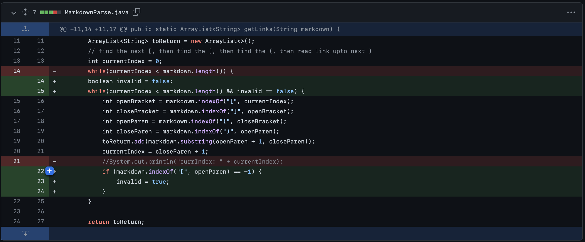
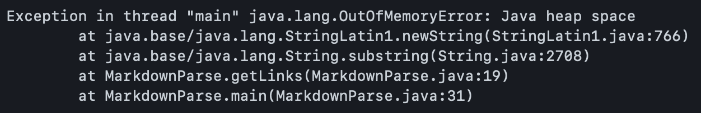

# First code change (image failure)


[Failure Inducing Test File](https://github.com/cgaldston/markdown-parser/blob/main/test-file-2.md)


Output: 
```
 calebgaldston@MacBook-Pro-7 markdown-parser % java MarkdownParse test-file-2.md
[sample_Image.jpg, practice_link.com]
```


The bug in MarkdownParse.java is that the parser was treating images the same as links. This resulted in it returning the address of the image along with the other links in the file. Images are not links, so therefore it should not return them.


# Second Code Change



[second failed test file](https://github.com/PeterNguyen4/markdown-parser/blob/main/second-test-file.md)

Output: 
