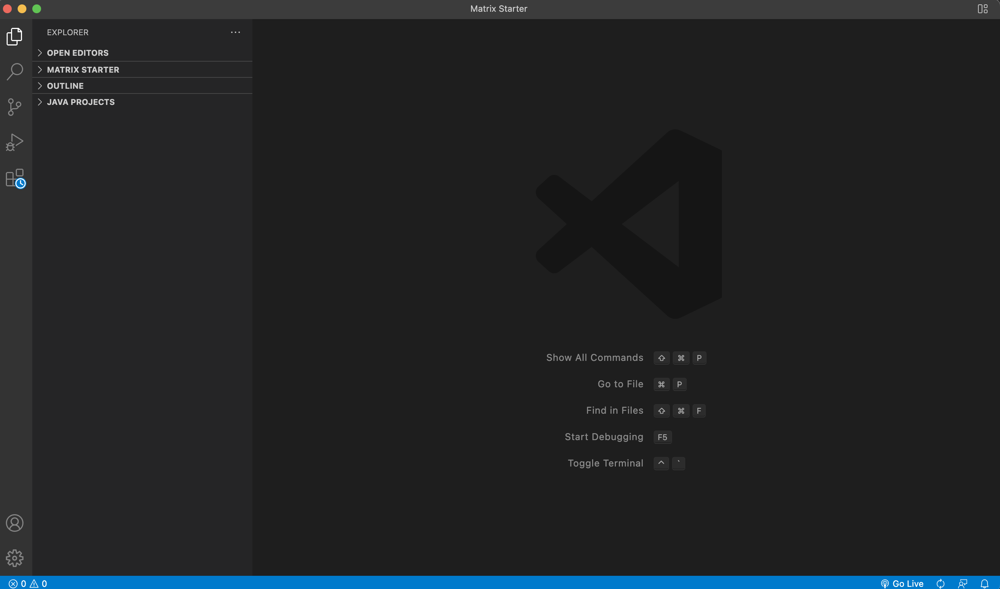
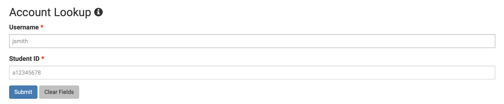
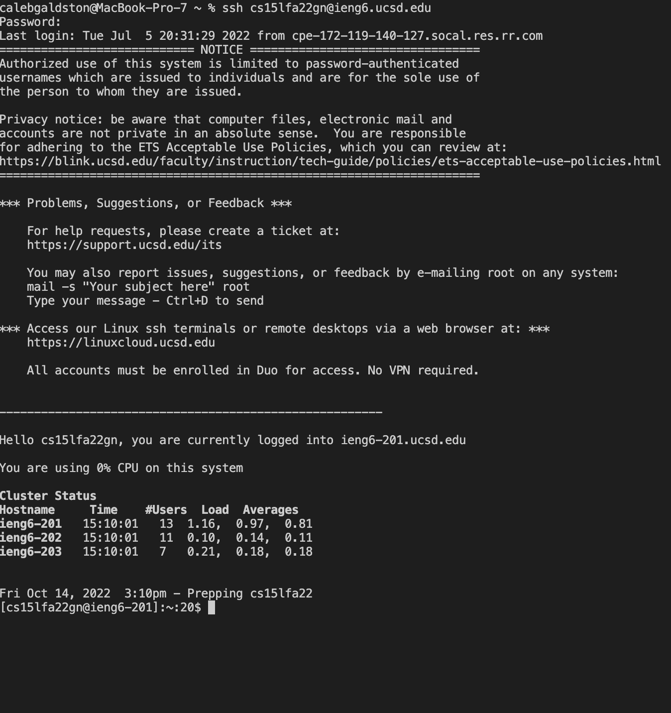
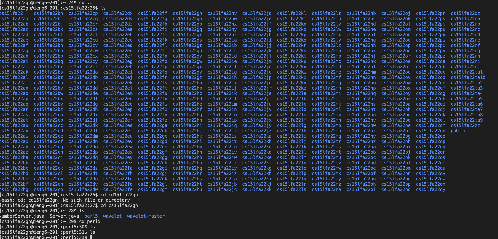
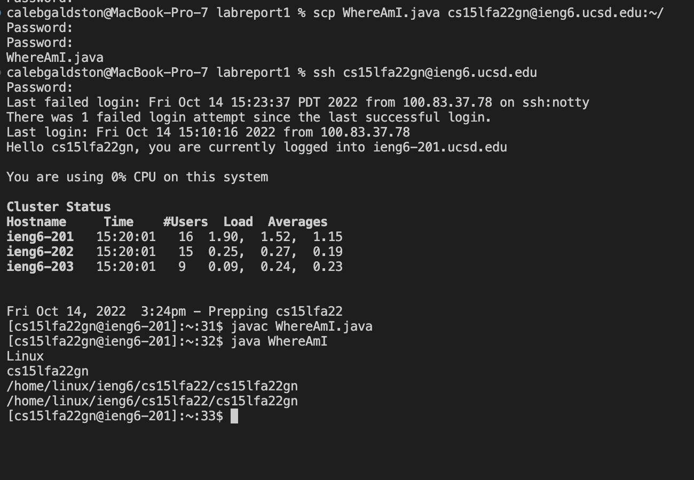

# Setting Up VSCode
In order to set up Visual Studio Code on your machine you will want to go the VS Code website at: [https://code.visualstudio.com/](https://code.visualstudio.com). Follow the instructions on the page for setting it up on your Operating System. Once it is all set up your home page should look like this: 

# Remotely Connecting
In order to remotely connect to a remote computer at UCSD. If you have windows, the first step will be to install OpenSSH at the link here: [Install OpenSSH](https://docs.microsoft.com/en-us/windows-server/administration/openssh/openssh_install_firstuse).

You will need to look up your CSE15L course-specific account here: [https://sdacs.ucsd.edu/~icc/index.php](https://sdacs.ucsd.edu/~icc/index.php)

You'll need to know your UCSD username and PID which you'll put into these fields: 

Next, you will connect to the remote  computer through VS Code. Open the terminal in VS Code and type in the following command:

$ ssh cs15lsp22zz@ieng6.ucsd.edu

Make sure to replace the zz with the letters in your ucsd-specific account. 

You'll get a series of messages ending with 

"Are you sure you want to continue connecting (yes/no/[fingerprint])?"

Type in yes and then enter your password. 

Once your password goes through it should display the following information. 


# Trying Some Commands

Try running a few different commands in the command line to see what happens. 

Here's a list of commands you should try:

* cd ~
* cd
* ls -lat
* ls 
* ls <directory> where <directory> is /home/linux/ieng6/cs15lsp22/cs15lsp22abc, where the abc is one of the other group members’ username
* cp /home/linux/ieng6/cs15lsp22/public/hello.txt ~/
* cat /home/linux/ieng6/cs15lsp22/public/hello.txt

Experiment with these commands and examine the different things that happen. 

Here's an example of some of the commands that I tested: 


# Moving Files With scp

In order to run our files on a remote computer we will be required to copy the files over to the remote computer using the scp command. 

Create a practice file called WhereAmI.java 

```
class WhereAmI {
  public static void main(String[] args) {
    System.out.println(System.getProperty("os.name"));
    System.out.println(System.getProperty("user.name"));
    System.out.println(System.getProperty("user.home"));
    System.out.println(System.getProperty("user.dir"));
  }
}
```

Compile it and run it using javac and java. 
Then use the scp command to copy it onto the remote computer: 
scp WhereAmI.java cs15lsp22zz@ieng6.ucsd.edu:~/ 

Then log into the remote computer and use the ls command and you should see your file there. 

Here's an example of it running succesfully: 

# Setting an SSH key

You can create an ssh key to make it easier to switch between local and the remote computer. In order to set this up here is what you should run. 
#on client (your computer)


$ ssh-keygen


Generating public/private rsa key pair.


Enter file in which to save the key (/Users/<user-name>/.ssh/id_rsa): /Users/<user-name>/.ssh/id_rsa

Enter passphrase (empty for no passphrase): 


Note: Make sure that you do not add a passphrase for this step.


Enter same passphrase again: 

And now you need to copy the key to the .ssh directory on your server

$ ssh cs15lsp22zz@ieng6.ucsd.edu

<Enter Password>

"#" now on server

$mkdir .ssh

$ <logout>

"#" back on client

$ scp /Users/<user-na

me>/.ssh/id_rsa.pub cs15lsp22zz@ieng6.ucsd.edu:~/.ssh/authorized_keys
You use your username and the path you saw in the command above


