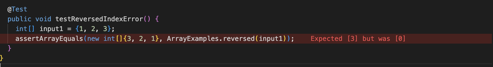
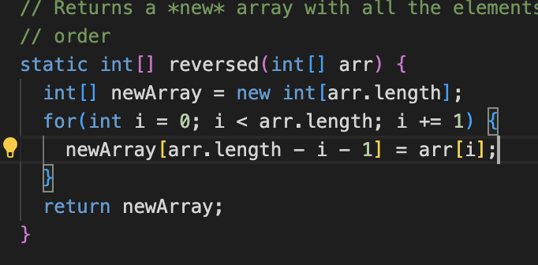
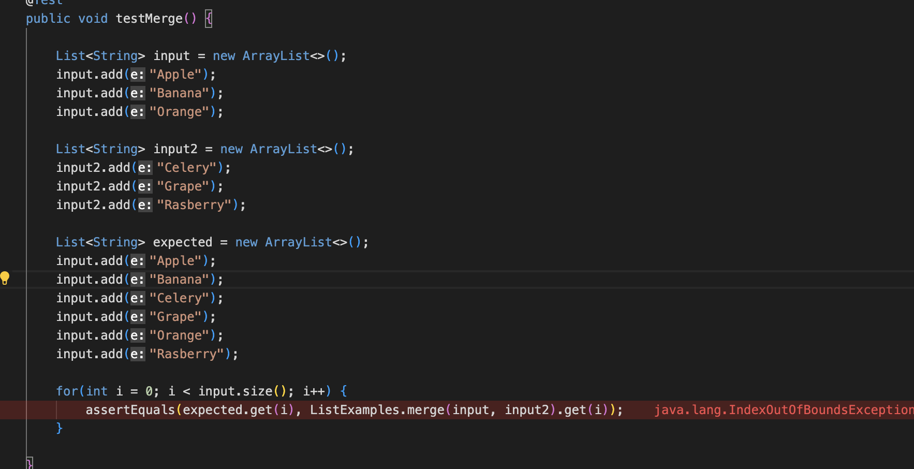
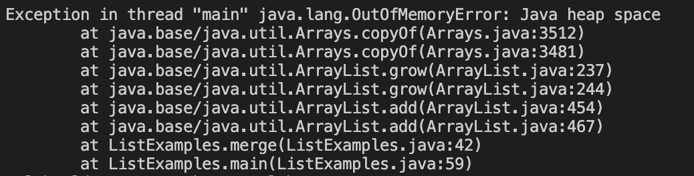
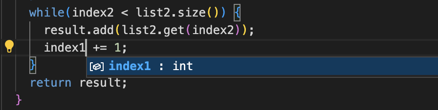

 # Part 1

```
import java.io.IOException;
import java.net.URI;
import java.util.List;
import java.util.ArrayList;

class Handler implements URLHandler {
    // The one bit of state on the server: a number that will be manipulated by
    // various requests.
    List<String> list = new ArrayList<>();

    public String handleRequest(URI url) {
        if (url.getPath().equals("/")) {
            for(int i = 0; i < list.size(); i++) {
                return String.format("%s", list.get(i));
            }
        } else {
            System.out.println("Path: " + url.getPath());
            if (url.getPath().contains("/add")) {
                String[] parameters = url.getQuery().split("=");
                if (parameters[0].equals("count")) {
                    return String.format("Number increased by %s! It's now 1");
                }
                else {
                    return "hey";
                }
            }
            return "404 Not Found!";
        }
    }
}


public class SearchEngine {
    public static void main(String[] args) throws IOException {
        if(args.length == 0){
            System.out.println("Missing port number! Try any number between 1024 to 49151");
            return;
        }

        int port = Integer.parseInt(args[0]);

        Server.start(port, new Handler());
    }
}
```

I couldn't get my search engine to work. Looking for feedback on the first part of this. 


# Part 2

## Bug Number 1 (Array)
 

 This demonstrates both the failure inducing input as well as the symptom of the bug. The symptom is that it returns an array of zeroes instead of the reversed array that its supposed to. 

 

 The issue with the method was that it was assigning values to the original array instead of the new one and then returning the original array. The new array was empty so it was simply assigning that value 0 to indexes of the original array and then returning that array. To solve this bug, I swapped `arr[i]` and `newArray[arr.length - i -1]` so that the values were being assigned to the new array. Then I returned the new array. 

 ## Bug Number 2(List)

Failure Inducing Input
 

Symptom:
 

 Bug:
 

 The bug in this method is that in the thrid while loop, each iteration it iterates index1 instead of index2. As a result, index2 is never increasing, so it will infintiely be less that the size of list2 as it remains the same. This causes a heap space error because the while loop runs infinitely. 


