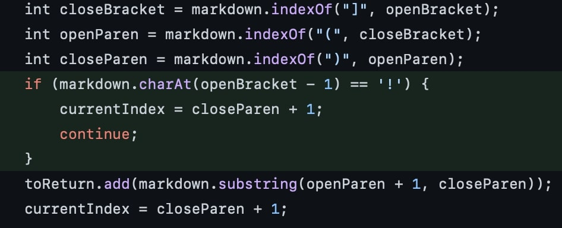
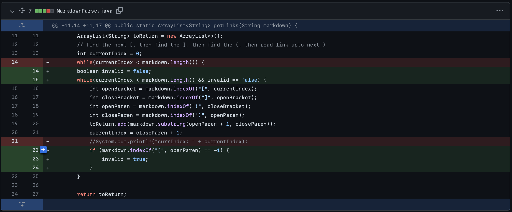
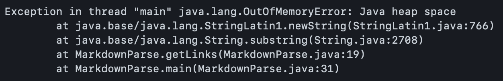
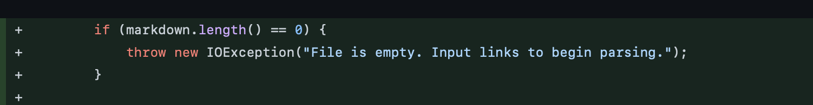

# First code change (image failure)


[Failure Inducing Test File](https://github.com/cgaldston/markdown-parser/blob/main/test-file-2.md)


Output: 
```
 calebgaldston@MacBook-Pro-7 markdown-parser % java MarkdownParse test-file-2.md
[sample_Image.jpg, practice_link.com]
```


The bug in MarkdownParse.java is that the parser was treating images the same as links. This resulted in it returning the address of the image along with the other links in the file. Images are not links, so therefore it should not return them.


# Second Code Change (Empty Lines)



[second failed test file](https://github.com/PeterNguyen4/markdown-parser/blob/main/second-test-file.md)

Output: 


The issue with this test file was that the empty lines between the links caused the program to time out. Once it got past the initial links the empty space caused it to run out of memory. 

# Third Code Change (Blank File)



[Third Failed Test File](https://github.com/PeterNguyen4/markdown-parser/blob/main/fourth-test-file.md)

Output: 


If you try to run this program on an empty file it will still return brackets, but with nothing in them. It should return an error message telling the user why there was an error running the program.