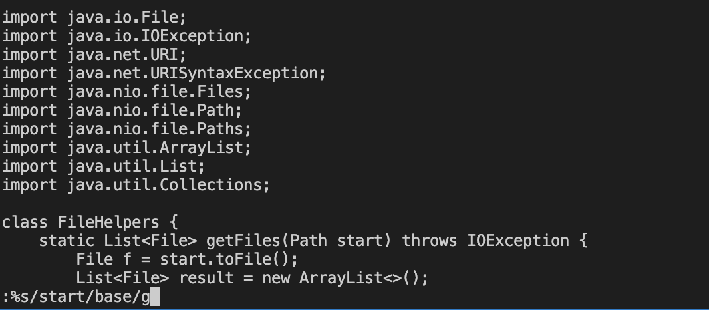
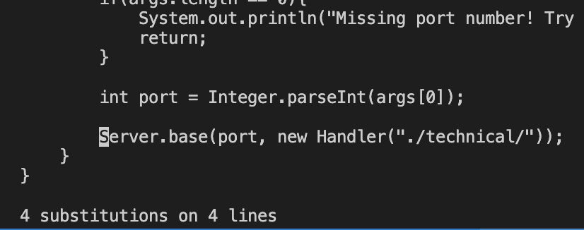

# For the task of changing the start parameter and all of its uses these are the keys I pressed

`:%s/start/base/g<Enter>`

This simply finds every instance of the start paramter and replaces it with the string base instead. 

# Part 2

For me the first method took about 45 seconds while the second one look me about 40 seconds. 

For me I think that I would choose the second option because I found it a lot easier to make the edits directly on the remote server rather than scp'ing them into the remote server. 

I don't really think there are many factors that would change my decision because no matter the change I feel that editing on the remote server is the way to go.l 