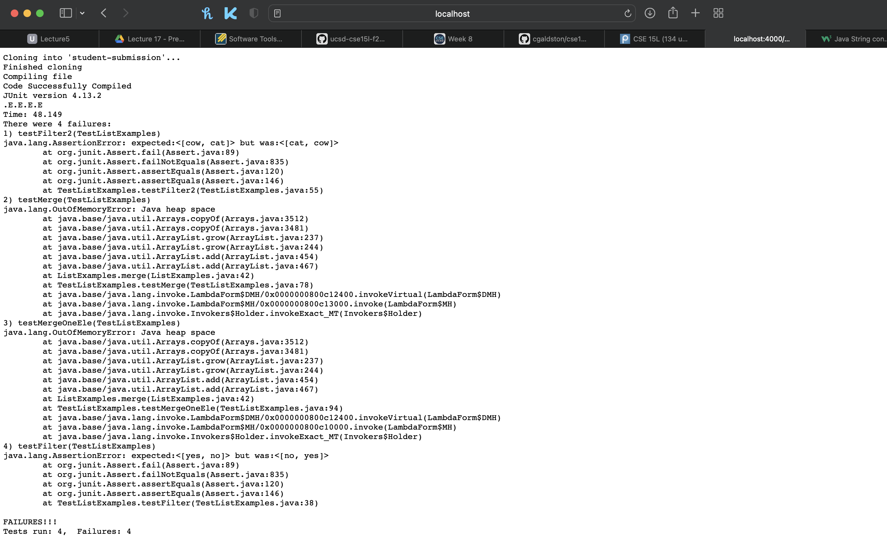
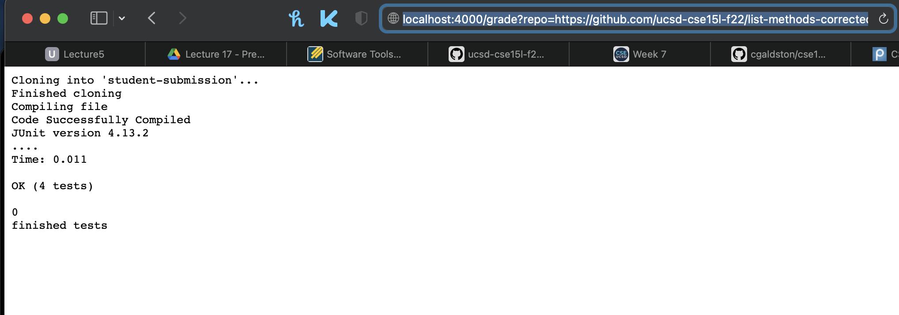
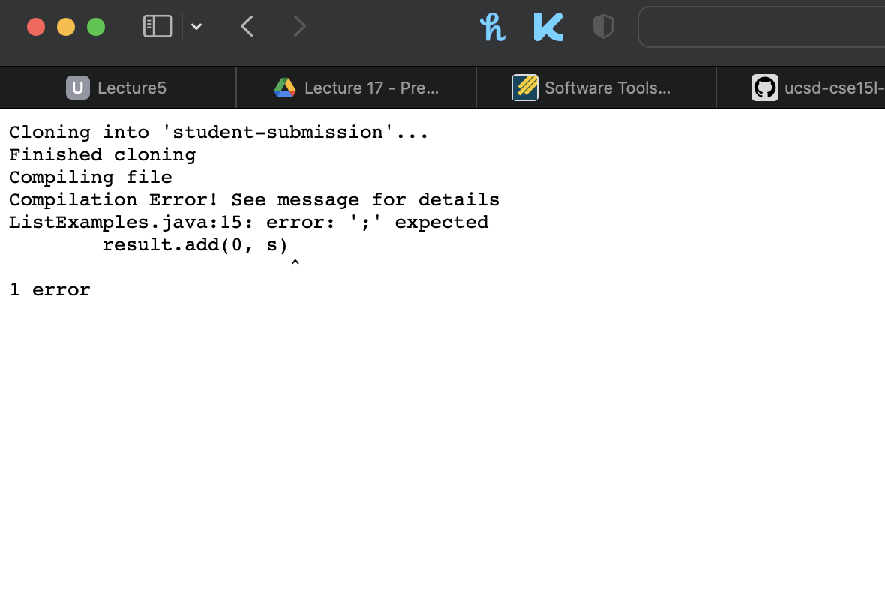

``` CPATH=".:../lib/hamcrest-core-1.3.jar:../lib/junit-4.13.2.jar"

rm -rf student-submission
git clone $1 student-submission
echo 'Finished cloning'

cp TestListExamples.java student-submission/
cd student-submission/


if [ -f "ListExamples.java" ]; then
    echo "Compiling file"
else
    echo "Incorrect File. ListExamples.java not found."
    exit
fi

javac -cp $CPATH *.java 2> compile-err.txt

if [ $? -eq "0" ]; then
       echo "Code Successfully Compiled"	
else
	echo "Compilation Error! See message for details"
	cat compile-err.txt
	exit
fi


java -cp $CPATH org.junit.runner.JUnitCore TestListExamples
echo $?
echo "finished tests"
```

Output for this link: \
[https://github.com/ucsd-cse15l-f22/list-methods-lab3](https://github.com/ucsd-cse15l-f22/list-methods-lab3)


Output for this link: \
[https://github.com/ucsd-cse15l-f22/list-methods-corrected](https://github.com/ucsd-cse15l-f22/list-methods-corrected)


Output for this link: \
[https://github.com/ucsd-cse15l-f22/list-methods-compile-error](https://github.com/ucsd-cse15l-f22/list-methods-compile-error)



## This is for example 2 from the Screenshots
- The first line of the grade.sh makes a folder called student-submission

- Next it clones the first argument from the terminal which corresponds to the variable $1 into the folder student-submission

- The first if statements checks whether the file "ListExamples.java" is in the folder student-submissions and says that the file is being compiled if it is found. If not, it displays an error message to the user saying that the file could not be found. 

- The next command compiles every file within the class path and reads any error message into a new file called compile-err.txt.

- The if statement following the compilation command checks whether or not the code compiled succesfully. By checking whether the compile command's output was 0 using $? which stores the output of the previous command, we can see whether the comile command had any output. If the code compiled successfully, than there should be no output. Anything otherwise reveals that there was some error. Since this error was stored in a file, we can output the error message to the user by calling on this file

- The next command calls the TestListExamples file on the ListExamples class that was created by compiling the ListExamples.java file. By outputting the $? command we reveal to the user which tests failed and which tests passed. 

